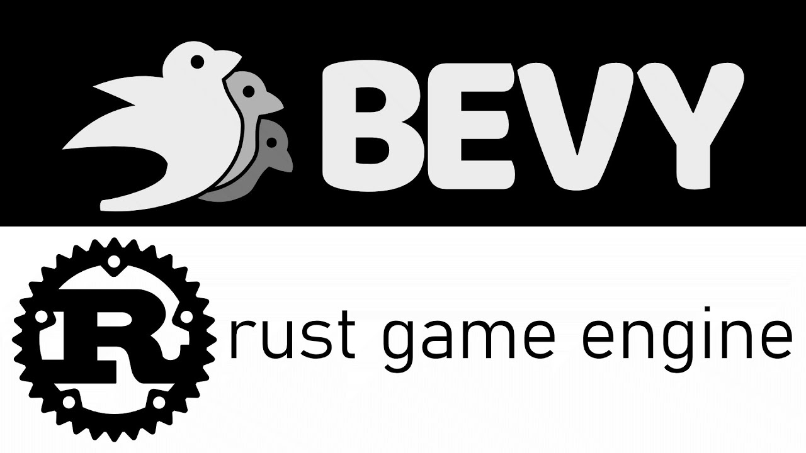
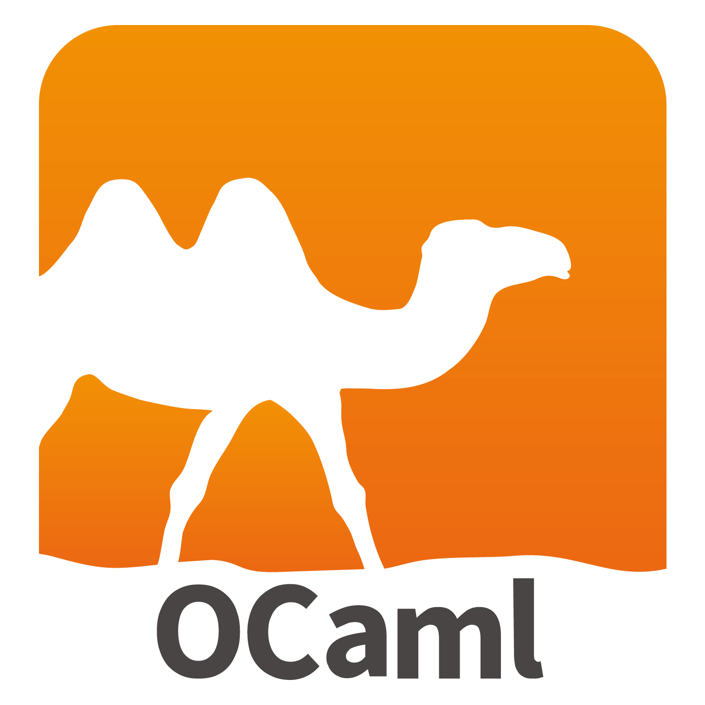
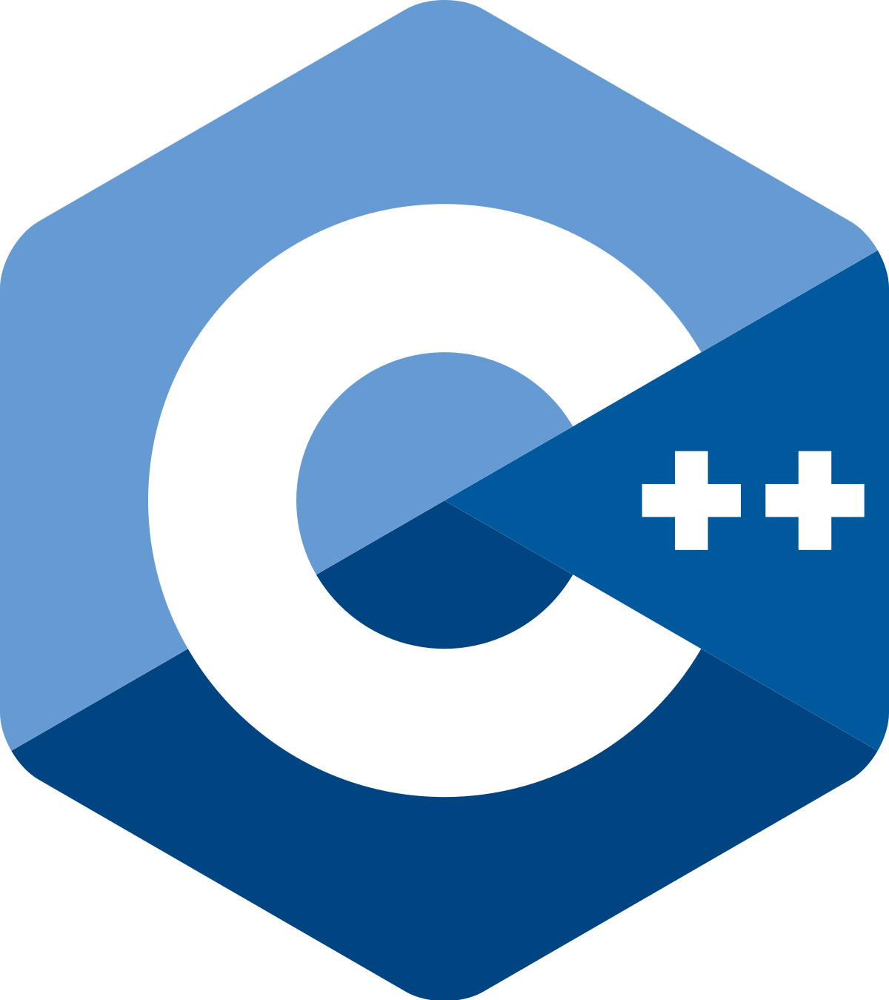

<!-- paginate: skip -->

# Learning to love the Rust Propaganda

Understand why Rust is the most loved and admired programming language

Alec Di Vito

February 2024

---

<!-- paginate: true -->

# Who am I?

- **Alec Di Vito** `@alecdivito`
- **Job**: ~~Senior~~ Staff Cloud Developer
- **Role**: Helping enable Terraform at RBC
- **Experience in:** Python, Go, Javascript, Java and Jenkinfiles
- **Loves:** 😍😍😍 Rust 😍😍😍

Get in Touch

- Linkedin
- RBC Slack and Email


---

## What we'll cover today 🤓

- What is Rust and who's adopted it
- Brief History of Rust
- 3 Rust features you wish your language had
- Rust community

## What we won't be doing 🙅

- Learning how to program in Rust

<!--
In this presentation I will cover what rust is, who in the industry is using it and how rust started.
In the second half, I'll cover some of rusts features and it's community.
-->

---

## What is this Rust?

- Rust is a **general purpose programming language**
  - Computer Systems
  - Embedded Systems
  - Applications


<!--

-->

---

## Systems programming

Foundational software that interacts directly with hardware and manages underly resources.

- Operating Systems
- Development tools
- Storage systems (hard drives)
- Databases


<!--
One use of Rust is to develop systems that interact directly with underly hardware.
These are foundationaly systems that someone would program their application on
top of.

Examples of systems programming could be operating systems, development tools and databases.
-->

---

## Embedded systems

Everyday devices that run software to do a physical function.

- Drones
- Medical Devices
- Space ships
- Wearable Technology


<!--
Some technology needs to work in mission critical scenarios where accessing them
is not an option. Rust memory safety features makes it a great choice for programming
embedded systems where it's not guaranteed the device will have an underlying operating system.

Examples of devices that maybe built with Rust are drones, medical devices and space ships
-->

---

## Application Programming

software applications to accomplish specific tasks or solve problems for users.

- Web Servers
- Web Browsers
- Game engines
- **Banks** 👀




<!--
Rust is also a good fit for developer building applications, such as Game engines,
Web browsers and servers, and dare i say banks.

It's strong type system means you can encode a lot of business rules straight into
the language.
-->

---

## Where is Rust used?

- [The Linux Kernel](https://www.kernel.org/doc/html/next/rust/index.html)
- [Microsoft is spending $10 million to use Rust across their engineering system](https://twitter.com/dwizzzleMSFT/status/1720134540822520268?s=20)
- [Google has pledged $1 million to improve interoperability with C++](https://thenewstack.io/google-spends-1-million-to-make-rust-c-interoperable/#:~:text=Google%20has%20pledged%20%241%20million,%2C%E2%80%9D%20according%20to%20the%20announcement.)
- [AWS built the Firecracker virtual machine in Rust](https://aws.amazon.com/blogs/opensource/why-aws-loves-rust-and-how-wed-like-to-help/)
- [Cloudflare](https://blog.cloudflare.com/tag/rust), [Figma](https://www.figma.com/blog/rust-in-production-at-figma/), [Meta](https://github.com/facebook/sapling), [and many more](https://github.com/omarabid/rust-companies?tab=readme-ov-file)
- Some teams at RBC 👀

> 🚀 **Congratulations**
> It's 2023 and Rust is the most admired programming language for 8 years in a row
> ‐ [2023 Stackoverflow Survey](https://survey.stackoverflow.co/2023/#section-admired-and-desired-programming-scripting-and-markup-languages)

<!--
Because Rust is so versional, it's used all over our industry. Tech giants like
Google, Microsoft and amazon have spent millions of dollars and time developing systems
that use Rust. They've also donated and contributed millions of dollars to
build support for Rust inside of their company or donated it to the Rust organization
so that it can continue to exist.

Companies like Cloudflare, Figma, Meta, RBC and many more have been using Rust
as well for some of their systems.

None of this is surprising because Rust has been the most admired language for
the past 8 years as reported by the 2023 stack overflow survey!
-->

---

# The story behind the Rust

<!--
With the amount of support Rust is getting, I think it's interesting to share the
story of why Rust was created.
-->

---


<!--
- It all started in 2006 when Graydon, a developer at mozilla, was coming home after a hard days work
- When he entered hist apartment building, he noticed that again, the elevator was out of service
- While walking up **21 floors** all he could think about was how software developers couldn't make an elevator work without crashing
- Rust was born, **"over-engineered for survival"**

-->

---

## History of Rust

- **Mozilla research** sponsored the project in 2009 for development of the **servo web browser engine**
- In 2015 it had it's 1.0 release
- Over the years Rust changed a lot


<!--

- After 3 years of development, the promises of the language made mozilla interested if they could build a better browser in Rust so the server project was born
- Rust changed a lot during this time and finally became more stable in 2015, when it had it's 1.0 release

-->

---

## [Goals of Servo browser](https://github.com/servo/servo/wiki/Design)

- New multithreaded web browser architecture
- Ability to safely spread work across multiple threads
- Eliminate vulnerabilities in managing memory and data races

> 🔔 **info**
> Microsoft estimates that 70% of the vulnerabilities in its code are due to memory errors from code written in languages like C/C++.

<!-- 
- The reason why Mozzila was interested in using Rust is because programming a multithreaded browser is hard.
- It's really easy to introduce memory safety issue when programming a large project in C/C++, as reported by microsoft which report that up to 70% of all vulnerabilities are memory related.
- By using Rust, Mozzila could easily make Rust safely multi-threaded and create a better web browser
-->

---

# Introducing Rust

<!--
Now it time to start digging into Rust
-->

---

## Rust Mascot

Rust has a _unofficial_ mascot named **Ferris** 🦀


<!-- 
And i first want to focus on the unofficial mascot of the rust programming language, Ferris.
Any good programming language has a mascot, and this is rusts.
-->

---

## Rust Influences

- **OCaml** for algebraic data types and pattern matching
- **C++** for references, smart pointers, move semantics, and more
- **Swift** for optional bindings
- **Erlang** for message passing, thread failure
- **Scheme** for hygienic macros
- [And More](https://doc.rust-lang.org/reference/influences.html)





<!--
Rust also isn't necessarily a unique language. It borrows lots of different parts
from different programming languages such as algebraic data types and pattern matching
from OCaml and references, smart pointers and move semantic from C++. It also borrows
features from swift, erlang, scheme and many more
-->

---

## Key words used in rust _for this presentation_


| Construct | Description |
| -------- | ---------------------------------------- |
| `struct` | Where you store all of your objects data |
| `enum`   | When an object could be in different states (example: `Some` or `None`) |
| `fn`     | A function that you can pass arguments to |
| `trait`s | Rust versions of interfaces from languages like Java |
| `mut`ability | Declaring if a variable is mutable |

<!--
Every language has reserved keywords that the language uses. These are some in which we'll be coving today.
-->

---

# The 3 Features you wish your language had

---

# 1. Strong Typing 💪

---

## A strong type system makes issues seen in languages like javascript impossible

For example take the following Javascript example will run

```javascript
assert(1 + "2" == 12)
```

In Rust, the string type needs to be converted to a number before doing the addition. A Rust developer may program the same test like so.

```rust
assert_eq!(1 + "2".parse::<u32>().unwrap(), 3)
```

---

## It can also require we check if something exists

For example take the following Python example

```python
dictionary = {}
variable = dictionary["does_it_exist?"]
do_foo(variable)
```

We grab a value from a dictionary, but we can **choose** to check it. Thats not the case in rust.

```rust
let dictionary = HashMap::new()
if let Some(value) = dictionary.get("does_it_exist?") {
    do_foo(value)
}
```

---

## And it will always guarantee memory points at something

For example take the following Go example

```go
var pointer *int
number := *pointer // 🚨 Segfault here
fmt.Println(number)
```

**This is impossible in Rust!** There is no example because it's impossible!

---

## Benefits of strong typing

- Reduced runtime errors
- Improved developer productivity
- Code is _correct_
- Built-in mitigation to memory vulnerabilities


<!--

Therefore, strong typing is a benefit because it moves the error checking from
runtime, to compile time. There is no longer a need to test your program at runtime
because the type system will prove your program works!

Rust strong type system is forcing you to put many small unit tests all a program.
This forces programmers to define their assumptions into their program.

Compare this to dynamic language's where it's expected for you to write assumptions
as unit tests. However I'm sure everyone knows, that doesn't always happen.

Strong typing makes writing correct code, which is code that does what you expect easier.
By spending more time up front coding, you'll no longer need to spend more time
debugging your code at runtime.

Finally, because of all of these requirements implemented by the type system,
a lot of memory class issues and vulnerabilities don't need to be planned for
because the system protects you from doing the wrong thing.
-->

---

# 2. The borrow checker 🤓

---

## Borrow Checker features

Rust answer to how to keep memory in your application safe. It's made up of 3 components:

1. Tracking **Ownership**
2. Checking **Borrows**
3. Validating **lifetime**

### If a program can't pass the borrow checker, it doesn't compile


<!--  -->

---

## Ownership

There can only ever be **one owner** of a variable.

```rust
fn passing_ownership(obj: ExampleStruct) {}

fn main() {
    let example = ExampleStruct {}
    passing_ownership(example) // <-- Move of `example` variable happens
    print!("{}", example)      // ERROR! `example` is now owned by the function
}
```

> Example of a Rust program that can't compile because ownership was **moved**

---

## Borrowing

Borrows in rust can happen multiple times to create multiple readers of existing data.

```rust
  let data = 5;
  let first_borrow = &data; 
  let second_borrow = &data;
  println!("first borrow: {}", first_borrow);
  println!("second borrow: {}", second_borrow);
```

> Can borrow a variable multiple times

---

## Mutable borrowing

But what if you wanted multiple `mut`able borrows?

```rust
  let mut data = 5;
  let first_borrow = &mut data; 
  let second_borrow = &mut data; // <-- 🚨 Error here
  // ERROR: cannot borrow `data` as mutable more than once at a time
  println!("first borrow: {}", first_borrow);
  println!("second borrow: {}", second_borrow);
```

It won't work and the program won't compile!

> Can only have 1 writer of data at a time

---

## Lifetimes

Validate that references are only borrowed for as long as they live.

```rust
// Must be explicit that we borrow a string for the lifetime of 'a
struct StringSlice<'a>(&'a str);

let message = "Hello, world";
let slice = StringSlice(&message[7..]); // Borrow the slice
println!("{}", slice.0);                // print "world"
```

> **Borrow's without context** require the lifetime to be explicit.

---

## Benefits of the borrow checker

- Early detection of memory management errors
- Quicker feedback loop when errors are in your program
- Clear ownership of variables


<!--

Using ownership, borrowing, and lifetime features, Rust is able to enforce that
at all time in a Rust program, there is only ever 1 writer and multiple
readers of variables.

This provides safety from data races every showing up in your program. It also
guards common errors from occurring such as use after free. This is where memory
has been released by the operating system but a reference to that memory
location still exists in the running program.

The borrow checker and strict typing system work together to show clear ownership
of a variable. With Rust, it's easy to determine if you are altering a
reference or the variable.
-->

---

# 3. Fearless concurrency 😏

---

## Multithread all workloads 🚀

**This is technically my first favorite feature!** But it depends on the strong type system and borrow checker exist!


<!--
- First favorite feature!
- Depends on type system and borrow checker
-->

---

## Fearless concurrency in action

Let's say I wanted to add up a counter using threads.

```rust
let mut num = Box::new(0);
println!("{}", num);
```

---

## Fearless concurrency in action

Spawn 10 threads in a row, and in each thread will increment the counter.

```rust
let mut num = Box::new(0);
for _ in 0..10 {
    thread::spawn(move || *num += 1);
}
println!("{}", num);
```

---

## Fearless concurrency in action

Before reading the variable, we want all threads to exit.

```rust
let mut thread_list = vec![];
let mut num = Box::new(0);
for _ in 0..10 {
    thread_list.push(thread::spawn(move || *num += 1));
}
let _ = thread_list.into_iter().map(JoinHandle::join);
println!("{}", num);
```


---

## Fearless concurrency in action

Annnnnnd, What? Error? Why?

```rust
let mut thread_list = vec![];
let mut num = Box::new(0);
for _ in 0..10 {
    thread_list.push(thread::spawn(move || *num += 1)); // <-- 🚨 Error
}
let _ = thread_list.into_iter().map(JoinHandle::join);
println!("{}", num);
```

> 🚨 Error 🚨 `num` value moved into closure here, in previous iteration of loop

---

## Fearless concurrency in action **for real this time**

Let's try this again but this time we'll use an `Arc` and `Mutex`.

```rust
let mut list = Vec::new();
let counter = Arc::new(Mutex::new(0));
for _ in 0..10 {

}
let _ = list.into_iter().map(JoinHandle::join);
println!("{}", *counter.lock().unwrap());
```

> 🔔 `Arc` is a reference counted pointer that can be shared across threads
> 🔔 `Mutex` is a gatekeeper to insure shared data is only accessed one at a time

---

## Fearless concurrency in action **for real this time**

The last error we had was because of `ownership`. So clone the pointer before we use it.

```rust
let mut list = Vec::new();
let counter = Arc::new(Mutex::new(0));
for _ in 0..10 {
    let cloned_counter_ptr = counter.clone();
}
let _ = list.into_iter().map(JoinHandle::join);
println!("{}", *counter.lock().unwrap());
```


---

## Fearless concurrency in action **for real this time**

Move the cloned pointer and lock the mutex. We can safely increment the integer.

```rust
let mut list = Vec::new();
let counter = Arc::new(Mutex::new(0));
for _ in 0..10 {
    let cloned_counter_ptr = counter.clone();

    list.push(thread::spawn(move || {
        let mut locked_counter = cloned_counter_ptr.lock().unwrap();
        *locked_counter += 1;
    }));

}
let _ = list.into_iter().map(JoinHandle::join);
println!("{}", *counter.lock().unwrap());
```

---

## Benefits

- Multithread safely
- Fearlessly increase performance of application
- Sleep easy at night because you didn't write it in python


<!--

By relying on the borrow checker, we can scale our code to use the full potential
of our CPU without being scared we are programming data races into our code. We
can fearlessly distribute our work across multiple threads and reap the increased
performance in our application.

Sleep easy knowing that when a Rust program compiles, it's means that 99% of the
time, it will work exactly the way you expect and won't wake you up at 1AM.

-->

---

# 🚀 ⚡️ Lightning round ⚡️ 🚀


---

## Error Messages

```rust
error[E0382]: use of moved value: `num`
  --> src/main.rs:36:40
   |
34 |     let mut num = Box::new(0);
   |         ------- move occurs because `num` has type `Box<i32>`, which does not implement the `Copy` trait
35 |     for _ in 0..10 {
36 |         thread_list.push(thread::spawn(move || *num += 1)); // <-- 🚨 Error
   |                                        ^^^^^^^ ---- use occurs due to use in closure
   |                                        |
   |                                        value moved into closure here, in previous iteration of loop
```

---

## Generics

```rust
fn print_to_console<D: std::fmt::Display>(d: D) {
    println!("{}", d);
}

print_to_console("hello, world")
print_to_console(42)
```

```
> cargo run
hello, world
42
```

---

## Testing in documentation

```rust
/// ```
/// use lib::add;
/// assert_eq!(add(41, 1), 42) // <---- this code runs on `cargo test`!!!
/// ```
pub fn add(left: usize, right: usize) -> usize {
    left + right
}
```

```
> cargo test --doc
running 1 test
test src/lib.rs - add (line 3) ... ok

test result: ok. 1 passed; 0 failed; 0 ignored; 0 measured; 0 filtered out; finished in 0.26s
```

---

## Rust Macros!

Quickly create a CLI application by marking up a struct with macros using the [`clap` package](https://docs.rs/clap/latest/clap/)!

```rust
/// Simple program to greet a person
#[derive(Parser, Debug)]
#[command(author, version, about, long_about = None)]
struct Args {
    /// Name of the person to greet
    #[arg(short, long)]
    name: String,

    /// Number of times to greet
    #[arg(short, long, default_value_t = 1)]
    count: u8,
}
```


---

## CLI in action

Just with a bit of macro markup we have a beautiful help

```bash
➜  example git:(main) ✗ cargo run -- --help
Simple program to greet a person

Usage: example [OPTIONS] --name <NAME>

Options:
  -n, --name <NAME>    Name of the person to greet
  -c, --count <COUNT>  Number of times to greet [default: 1]
  -h, --help           Print help
  -V, --version        Print version
```


---

## More Rust Macros

Those are the main ones I've used but theres more like:

- Need to work with JSON, XML, YAML, ect? Use the popular [`serde` crate](https://crates.io/crates/serde)
- Create types from `graphql` queries automatically thanks to [`graphql_client`](https://crates.io/crates/graphql_client)
- Love the builder pattern? Theres a macro for that! [`derive_builder`](https://crates.io/crates/derive_builder)


---

## More Rust Macros

How about validating SQL at compile time?
.
.
**YUP RUST CAN DO THAT** thanks to the [crate `sqlx`](https://docs.rs/sqlx/latest/sqlx/)!

```rust
sqlx::query!(r#"SELECT id, description, done FROM todos ORDER BY id"#)
    .fetch_all(pool)
    .await?;
```


---

## 🤯 🤯 🤯 MORE MACROS WTF!!! 🤯 🤯 🤯

WAIT YOU WANT TO PROGRAM YOUR **NODE** AND **PYTHON** PACKAGES IN RUST TOO!! 🤝 (*Respect* 😏)

Well let me tell you...**RUST.CAN.DO.THAT.TO** 🧠 🧠 🧠

- Don't like using `react` cause it's slow 🤢? Use the [crate `yew`](https://crates.io/crates/yew) instead and program your frontend in Rust 🤩!
- Need to go fast 🚀 but you use Javascript 🤦‍♂️? No worries, [use `wasm-pack`](https://rustwasm.github.io/docs/wasm-pack/introduction.html) to deploy Rust code as an npm module 🫢!
- Using Python 😭? Ditch the _training wheels_ 😎 and go **fast** by using rust to build a native python extension module using [`pyo3`](https://github.com/PyO3/pyo3)


---

## 🚨 BUT WAIT! THERES MORE! 🚨

- Powerful Trait system 💪
- Zero cost abstractions 👌
- Iterators 🚅
- Channels and message passing ✉️
- Cross platform support 💻
- `async` / `await` 🚀
- **New releases of Rust every 6 weeks** 🤯
- Update language in one command
- Built in package manager
- AND SO MUCH MORE!


---

# Where can i learn more Rust?!?!

---

## Where can I learn more? 📖

- [**Rust book**](https://doc.rust-lang.org/): Learn the basics of the language
- [**Google Comprehensive Rust**](https://google.github.io/comprehensive-rust/): Googles introduction to rust
- [**Learn Rust with entirely too many linked lists**](https://rust-unofficial.github.io/too-many-lists/): More advanced rust
- [**Jon Gjengset @jonhoo**](https://www.youtube.com/c/jongjengset): Youtube channel covering advanced rust
- [**Proc Macro workshop**](https://github.com/dtolnay/proc-macro-workshop): Workshop example on how to make your own rust macros
- [**Mini-LSM**](https://skyzh.github.io/mini-lsm/): Tutorial on building a Log Structured Merge-tree database
- So much more, just need to look 🤯

<!--
I understand if this presentation has made you interested in learning why Rust is such a loved language. To help support you on this journey, Try and review the following:
-->

---

## How can I stay in the loop? 🎧

- [**This week in Rust**](https://this-week-in-rust.org) - Weekly articles about Rust made by the community
- [**Rustacean Station**](https://rustacean-station.org) - Podcasts on rust the language and it's projects
- [**Rust**](https://www.youtube.com/@RustVideos) - Youtube channel with talks and projects on rust

Other forms I use is also following maintainers

- [**Niko Matsakis Blog**](https://smallcultfollowing.com/babysteps/) - About the language and it's development
- [**Yoshua Wuyts**](https://blog.yoshuawuyts.com) - A lot of Discussions about everything Rust
- [**Faster than lime**](https://fasterthanli.me/) - Discussion on Rust and general programming

---

## More "Consider Rust" Presentations 🙇‍♂️

- [Considering Rust](https://www.youtube.com/watch?v=DnT-LUQgc7s) by Jon Gjengset
- [Unlocking Rust's power through mentorship and knowledge spreading, with Tim McNamara](https://open.spotify.com/episode/32rkz55Jm4MRsO1AEmH9UT?si=b1e1791c40ff47be) who lead Rust education across Amazon

---

## Call to Action

- Talk to your co-workers about this presentation if they didn't attend!
- If you have some time, reading the [**Rust book**](https://doc.rust-lang.org/)
- If you like watching videos look into [**Jon Gjengset Youtube channel**](https://www.youtube.com/c/jongjengset)
- Subscribe to the [**This week in Rust**](https://this-week-in-rust.org) new letter
- If you learn better by doing, try and contribute to `Innersource-commons/rbc-security-rust`

### Just go use the language and understand why it's so loved

---

# Thanks for listening


<!-- https://twitter.com/p1xelHer0/status/1754011970158669855 -->
