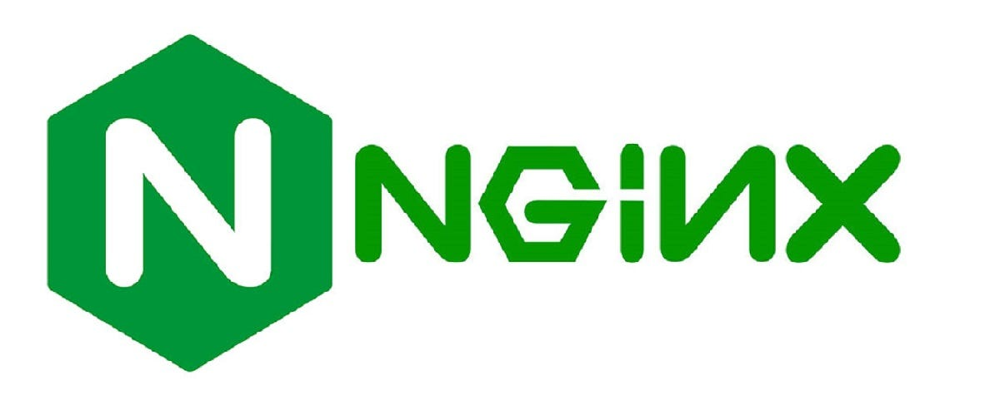

<!-- paginate: skip -->

# Learning to love the Rust Propaganda

Understand why Rust is the most loved and admired language today

Alec Di Vito

February 2024

---

<!-- paginate: true -->

# Who am I?

- **Alec Di Vito**
- **Job**: ~~Senior~~ Staff Cloud Developer
- **Role**: Helping enable Terraform at RBC
- **Experience in:** Python, Go, Javascript, Java and Jenkinfiles
- **Loves:** 😍😍😍 Rust 😍😍😍

Get in Touch

- Slack
- Email


---

## What we'll cover today 🤓

- What is Rust and who's adopted it
- Brief History of Rust
- Rust features
- Rust tools and ecosystem

## What we won't be doing 🙅

- Learning how to program in Rust 

---

## What is this Rust?

- Rust is a **general purpose programming language**
  - Systems programming
  - Embedded systems
  - Application programming
- Rust's features
  - Performance
  - Type Safety
  - Memory Safety
  - Fearless Concurrency


---

## Systems programming

Foundational software that interacts directly with hardware and manages resources.

- Operating Systems
- Development tools
- Storage systems (hard drives)
- Databases


---

## Embedded systems

Everyday devices that run software to do a physical function.

- Drones
- Medical Devices
- Appliances
- Wearable Technology


---

## Application Programming

Software the implements some type of user, business or automation requirement through coded functions.

- Web Servers
- Web Browsers
- IPhone Apps
- Banks 👀




---

## Where is Rust used?

- [The Linux Kernel](https://www.kernel.org/doc/html/next/rust/index.html)
- [Microsoft is spending $10 million to use Rust across their engineering system](https://twitter.com/dwizzzleMSFT/status/1720134540822520268?s=20)
- [Google has pledged $1 million to improve interoperability with C++](https://thenewstack.io/google-spends-1-million-to-make-rust-c-interoperable/#:~:text=Google%20has%20pledged%20%241%20million,%2C%E2%80%9D%20according%20to%20the%20announcement.)
- [AWS built the Firecracker virtual machine in Rust](https://aws.amazon.com/blogs/opensource/why-aws-loves-rust-and-how-wed-like-to-help/)
- [Cloudflare](https://blog.cloudflare.com/tag/rust), [Figma](https://www.figma.com/blog/rust-in-production-at-figma/), [Meta](https://github.com/facebook/sapling), [and many more](https://github.com/omarabid/rust-companies?tab=readme-ov-file)
- Some teams at RBC 👀

> 🚀 **Congratulations**
> It's 2023 and Rust is the most admired programming language for 8 years in a row
> ‐ [2023 Stackoverflow Survey](https://survey.stackoverflow.co/2023/#section-admired-and-desired-programming-scripting-and-markup-languages)

---

# The story behind the project

---


<!--

- Started as a personal project in 2006 by Graydon Hoare
- He was a 29 year old developer working at **Mozilla**
- The elevator wasn't working again after work; Software had crashed
- While walking up **21 floors** he thought about how software developers couldn't make an elevator work without crashing
- Rust was born, **"over-engineered for survival"**

-->

---

## History of Rust

- **Mozilla research** sponsored the project in 2009 for development of **servo web browser engine**
- Over the years Rust changed a lot
- In 2015 it had it's 1.0 release


<!--

- Growing adoption

-->

---

## [Goals of Servo browser](https://github.com/servo/servo/wiki/Design)

- New multithreaded web browser architecture
- Ability to safely spread work across multiple threads
- Eliminate vulnerabilities in managing memory and data race

> 🔔 **info**
> Microsoft estimates that 70% of the vulnerabilities in its code are due to memory errors from code written in these languages.

<!-- 

Our goal is to create an architecture that takes advantage of parallelism at
many levels while eliminating common sources of bugs and security vulnerabilities
associated with incorrect memory management and data races.

- By spending more time up front, you could just skip programming memory bugs
- Browsers are often an attack vector for hackers
- What if the program we used could protect us from most attacks?

- Main goal was to develop a safer browser engine

-->

---

# Introducing Rust

---

## Rust Influences

- **OCaml** for algebraic data types and pattern matching
- **C++** for references, smart pointers, move semantics, and more
- **Swift** for optional bindings
- **Scheme** for hygienic macros
- **Erlang** for message passing, thread failure
- [And More](https://doc.rust-lang.org/reference/influences.html)

<!--
Rust is not an original language, instead it's borrowed design elements from a wide variety of languages.
-->

---

## Key words used in rust _for this presentation_


| Construct | Description |
| -------- | ---------------------------------------- |
| `struct` | Where you store all of your objects data |
| `enum`   | When an object could be in different states (example: `Some` or `None`) |
| `fn`     | A function that you can pass arguments to |
| `trait`s | Rust versions of interfaces from languages like Java |
| `mut`ability | Declaring if a variable is mutable |

<!--
Every language has reserved keywords that the language uses. These are some in which we'll be coving today.
-->

---

# The 3 Features you wish your language had

---

# 1. Strong Typing 💪

---

## Benefits of strong typing

- Reduced runtime errors
- Improved developer productivity
- Code clarity and understanding
- Built-in mitigation to vulnerability security

<!--

Rust can catch multiple of errors before compile time

Reduced runtime errors: Emphasize how strong typing in Rust catches many type mismatches at compile time, preventing runtime crashes and unexpected behavior. Present examples of potential bugs that could arise in loosely typed languages due to incorrect type usage.
Improved developer productivity: Highlight how strong typing helps developers write more reliable and maintainable code by enforcing type safety. Mention features like autocompletion and type checking that aid in catching errors early in the development process.
Code clarity and understanding: Explain how explicit type declarations in Rust contribute to self-documenting code, making it easier for other developers to understand and modify the codebase. Use code snippets to illustrate the difference in clarity between strong and loose typing.
Security benefits: Point out how strong typing can help mitigate certain security vulnerabilities, such as buffer overflows and memory leaks, which are more common in loosely typed languages. Briefly discuss Rust's memory management features.

- Rust main feature
- Types are like small tests all over your program
- Protect your team by requiring you to think of all possible errors during development
- Explicit typing to make variables `mut`able and `pub`lic

1. Can't convert variables between types easily
2. Strict validation that a type implements a behavior (interface) at compile time

-->

---

## A strong type system makes issues seen in languages like javascript impossible

For example take the following Javascript example

```javascript
assert(1 + "2" == 12)
```

<br />

In Rust, the string type needs to be converted to a number before doing the addition. A Rust developer may program the same test like so.

```rust
assert_eq!(1 + "2".parse::<u32>().unwrap(), 3)
```

---

## Strong Types enforce error handling practices

But **what if** a non-number string is parsed and we `unwrap`?

```rust
assert_eq!(1 + "Ruh Roh 🐶".parse::<u32>().unwrap(), 3)
```

<br />

Instead of `unwrap`, use `match` to handle all cases of the `Result` enum!

```rust
match "2".parse::<u32>() {
    Ok(num) => assert_eq!(1 + num, 3),
    Err(err) => { ... } // handle the error
}
```

---

# 2. The borrow checker 🤓

---

## Borrow Checker features

Rust answer to how to keep memory in your application safe. It's made up of 3 components:

1. Tracking **Ownership**
2. Checking **Borrows**
3. Validating **lifetime**

### If a program can't pass the borrow checker, it doesn't compile


---

## Ownership

There can only ever be **one owner** of a variable.

```rust
fn passing_ownership(obj: ExampleStruct) {}

fn main() {
    let example = ExampleStruct {}
    passing_ownership(example) // <-- Move of `example` variable happens
    print!("{}", example)      // ERROR! `example` is now owned by the function
}
```

> Example of a Rust program that can't compile because ownership was **moved**

---

## Borrowing

Borrows in rust can happen multiple times to create multiple readers of data.

```rust
  let data = 5;
  let first_borrow = &data; 
  let second_borrow = &data;
  println!("first borrow: {}", first_borrow);
  println!("second borrow: {}", second_borrow);
```

> Can borrow a variable multiple times

---

## Mutable borrowing

But only one reference is allowed to be `mut`able.

```rust
  let mut data = 5;
  let first_borrow = &mut data; 
  let second_borrow = &mut data; // <-- 🚨 Error here
  // ERROR: cannot borrow `data` as mutable more than once at a time
  println!("first borrow: {}", first_borrow);
  println!("second borrow: {}", second_borrow);
```

> But only if the variable is read-only

---

## Lifetimes

Validate that references are only borrowed for as long as they live.

```rust
struct StringSlice<'a>(&'a str); // Must be explicit that we borrow a string for 'a

fn print_slice<'a>(slice: StringSlice<'a>) { // lifetimes are generic
    println!("{}", slice.0);
}

let message = "Hello, world";
let slice = StringSlice(&message[7..]); // Borrow the slice
print_slice(slice)
```

> Borrow's without context require a lifetime to be explicit.

---

## Benefits of the borrow checker

- Early detection of memory management errors
- Quicker feedback loop when errors are in your program
- Clear ownership of variables


---

# 3. Fearless concurrency 😏

---

## Multithread all workloads 🚀

**This is technically my first favorite feature!** But it depends on the strong type system and borrow checker exist!

### Benefits

- Multithread safely
- Fearlessly increase performance of application
- Sleep easy at night because you didn't write it in python

<!--
Highlight the Benefits for Programmers:

Focus on Safety:
Emphasize how fear of concurrency-related bugs disappears with Rust's built-in guarantees.
Mention reduced debugging time and stress from knowing your code is thread-safe by default.
Reduce Boilerplate:
Show how Rust avoids complex locking code and thread management, leading to concise and readable concurrency constructs.
Compare the simpler syntax of channels and message passing to manual primitives in other languages.
Increased Performance:
Briefly mention the potential performance advantages of zero-cost abstractions and efficient memory management in Rust's concurrency system.
Explain how avoiding unnecessary locking and data copying can contribute to faster applications.
-->

---

## Fearless concurrency in action

Let's say I wanted to add up a counter using threads.

```rust
let mut num = Box::new(0);
println!("{}", num);
```

---

## Fearless concurrency in action

Spawn 10 threads in a row, and in each thread will increment the counter.

```rust
let mut num = Box::new(0);
for _ in 0..10 {
    thread::spawn(move || *num += 1);
}
println!("{}", num);
```

---

## Fearless concurrency in action

Before reading the variable, we want all threads to exit.

```rust
let mut thread_list = vec![];
let mut num = Box::new(0);
for _ in 0..10 {
    thread_list.push(thread::spawn(move || *num += 1));
}
let _ = thread_list.into_iter().map(JoinHandle::join);
println!("{}", num);
```


---

## Fearless concurrency in action

Annnnnnd, What? Error? Why?

```rust
let mut thread_list = vec![];
let mut num = Box::new(0);
for _ in 0..10 {
    thread_list.push(thread::spawn(move || *num += 1)); // <-- 🚨 Error
}
let _ = thread_list.into_iter().map(JoinHandle::join);
println!("{}", num);
```

> 🚨 Error 🚨 `num` value moved into closure here, in previous iteration of loop

---

## Fearless concurrency in action **for real this time**

Let's try this again but this time we'll use an `Arc`.

```rust
let mut list = Vec::new();
let counter = Arc::new(Mutex::new(0));
for _ in 0..10 {

}
let _ = list.into_iter().map(JoinHandle::join);
println!("{}", *counter.lock().unwrap());
```

---

## Fearless concurrency in action **for real this time**

The last error we had was because of `ownership`. So clone the pointer before we use it.

```rust
let mut list = Vec::new();
let counter = Arc::new(Mutex::new(0));
for _ in 0..10 {
    let cloned_counter_ptr = counter.clone();
}
let _ = list.into_iter().map(JoinHandle::join);
println!("{}", *counter.lock().unwrap());
```


---

## Fearless concurrency in action **for real this time**

Move the cloned pointer and lock the mutex. We can safely increment the integer.

```rust
let mut list = Vec::new();
let counter = Arc::new(Mutex::new(0));
for _ in 0..10 {
    let cloned_counter_ptr = counter.clone();

    list.push(thread::spawn(move || {
        let mut locked_counter = cloned_counter_ptr.lock().unwrap();
        *locked_counter += 1;
    }));

}
let _ = list.into_iter().map(JoinHandle::join);
println!("{}", *counter.lock().unwrap());
```

---

# 🚀 ⚡️ Lightning round ⚡️ 🚀


---

## Error Messages

```rust
error[E0382]: use of moved value: `num`
  --> src/main.rs:36:40
   |
34 |     let mut num = Box::new(0);
   |         ------- move occurs because `num` has type `Box<i32>`, which does not implement the `Copy` trait
35 |     for _ in 0..10 {
36 |         thread_list.push(thread::spawn(move || *num += 1)); // <-- 🚨 Error
   |                                        ^^^^^^^ ---- use occurs due to use in closure
   |                                        |
   |                                        value moved into closure here, in previous iteration of loop
```

---

## Generics

```rust
fn print_to_console<D: std::fmt::Display>(d: D) {
    println!("{}", d);
}

print_to_console("hello, world")
print_to_console(42)
```

```
> cargo run
hello, world
42
```

---

## Testing in documentation

```rust
/// ```
/// use lib::add;
/// assert_eq!(add(41, 1), 42) // <---- this code runs on `cargo test`!!!
/// ```
pub fn add(left: usize, right: usize) -> usize {
    left + right
}
```

```
> cargo test --doc
running 1 test
test src/lib.rs - add (line 3) ... ok

test result: ok. 1 passed; 0 failed; 0 ignored; 0 measured; 0 filtered out; finished in 0.26s
```

---

## Rust Macros!

Quickly create a CLI application by marking up a struct with macros using the [`clap` package](https://docs.rs/clap/latest/clap/)!

```rust
/// Simple program to greet a person
#[derive(Parser, Debug)]
#[command(author, version, about, long_about = None)]
struct Args {
    /// Name of the person to greet
    #[arg(short, long)]
    name: String,

    /// Number of times to greet
    #[arg(short, long, default_value_t = 1)]
    count: u8,
}
```


---

## CLI in action

Just with a bit of macro markup we have a beautiful help

```bash
➜  example git:(main) ✗ cargo run -- --help
Simple program to greet a person

Usage: example [OPTIONS] --name <NAME>

Options:
  -n, --name <NAME>    Name of the person to greet
  -c, --count <COUNT>  Number of times to greet [default: 1]
  -h, --help           Print help
  -V, --version        Print version
```


---

## More Rust Macros

How about validating SQL at compile time?
**YUP RUST CAN DO THAT** thanks to the [crate `sqlx`](https://docs.rs/sqlx/latest/sqlx/)!

```rust
sqlx::query!(r#"SELECT id, description, done FROM todos ORDER BY id"#)
    .fetch_all(pool)
    .await?;
```

Those are the main ones I've used but theres more like:

- Need to work with JSON, XML, YAML, ect? Use the popular [`serde` crate](https://crates.io/crates/serde)
- Create types for `graphql` queries thanks to [`graphql_client`](https://crates.io/crates/graphql_client)
- Love the builder pattern? Theres a macro for that! [`derive_builder`](https://crates.io/crates/derive_builder)


---

## MORE MACROS WTF!!! 🤯

WAIT YOU WANT TO PROGRAM YOUR NODE AND PYTHON PACKAGES IN RUST TOO!! 🚀 (Respect 😏)

Well let me tell you...**RUST.CAN.DO.THAT.TO** 🧠

- Don't like using that startup library called `react` 🤢? Use the [crate `yew`](https://crates.io/crates/yew) instead and program your frontend in Rust 🤩!
- Need to go fast but you use Javascript 🤦‍♂️? No worries, [use `wasm-pack`](https://rustwasm.github.io/docs/wasm-pack/introduction.html) to deploy Rust code as an npm module 🤯!
- Need a fast language but your stuck with Python 😭. Gain some _wheels_ ♿️ by developing a native python extension module using [`pyo3`](https://github.com/PyO3/pyo3)


---

## 🚨 BUT WAIT! THERES MORE! 🚨

- Powerful Trait system 💪
- Zero cost abstractions 👌
- Iterators 🚅
- Channels and message passing ✉️
- Cross platform support
- `async` / `await`
- New releases of Rust every 6 weeks
- Update language in one command
- And soooooo much more!


---

# Rust tools

---

## Cargo

Package manager and build system for Rust.

```
➜  lib git:(main) ✗ cargo search tokio
tokio = "1.36.0"                  # An event-driven, non-blocking I/O platform for writing asynchronous I/O backed applications. 
console-subscriber = "0.2.0"      # A `tracing-subscriber::Layer` for collecting Tokio console telemetry. 
tokio-console = "0.1.10"          # The Tokio console: a debugger for async Rust. 
pyo3-asyncio = "0.20.0"           # PyO3 utilities for Python's Asyncio library
pyo3-asyncio-macros = "0.20.0"    # Proc Macro Attributes for PyO3 Asyncio
mailerlite-rs = "1.0.0"           # MailerLite Rust SDK
tokio-metrics = "0.3.1"           # Runtime and task level metrics for Tokio applications. 
tokio-context = "0.1.3"           # Contexts for cancelling asynchronous tasks using tokio
tokio_with_wasm = "0.4.0"         # Mimicking tokio functionalies on web browsers
tokio-graceful = "0.1.6"          # util for graceful shutdown of tokio applications
```

---

## Rustup

Install, manage and update rust toolchains with one command

```
rustup update
```

---

## Rust Analyzer

Great language and type predication integration inside of any IDE that supports **Language Server Protocol** (LSP)

- Infer types from other variables, function and traits
- Expand macros in the background
- Have rust errors by default show in your IDE

---

# So you want to try love Rust, now what?

---

## Where can I learn more?

- [**Rust book**](https://doc.rust-lang.org/): Learn the basics of the language
- [**Google Comprehensive Rust**](https://google.github.io/comprehensive-rust/): Googles introduction to rust
- [**Learn Rust with entirely too many linked lists**](https://rust-unofficial.github.io/too-many-lists/): More advanced rust
- [**Jon Gjengset**](https://www.youtube.com/c/jongjengset): Youtube channel covering advanced projects and material in rust
- [**Proc Macro workshop**](https://github.com/dtolnay/proc-macro-workshop): Workshop example on how to make your own rust macros
- [**Mini-LSM**](https://skyzh.github.io/mini-lsm/): Tutorial on building a Log Structured Merge-tree database
- So much more, just need to look 🤯

<!--
I understand if this presentation has made you interested in learning why Rust is such a loved language. To help support you on this journey, Try and review the following:
-->

---

## How can I stay in the loop?

- [**This week in Rust**](https://this-week-in-rust.org) - Weekly articles about Rust made by the community
- [**Rustacean Station**](https://rustacean-station.org) - Podcasts on rust the language and it's projects
- [**Rust**](https://www.youtube.com/@RustVideos) - Youtube channel with talks and projects on rust

Other forms I use is also following maintainers

- [**Niko Matsakis Blog**](https://smallcultfollowing.com/babysteps/) - About the language and it's development
- [**Yoshua Wuyts**](https://blog.yoshuawuyts.com) - A lot of Discussions about everything Rust

To get more involved, I would recommend subscribing to this week in rust. They have a section on contributing to open source projects that need help.

---

## More "Consider Rust" Presentations

- [Considering Rust](https://www.youtube.com/watch?v=DnT-LUQgc7s) by Jon Gjengset
- [Unlocking Rust's power through mentorship and knowledge spreading, with Tim McNamara](https://open.spotify.com/episode/32rkz55Jm4MRsO1AEmH9UT?si=b1e1791c40ff47be) who lead Rust education across Amazon

---

# Thanks for listening


<!-- https://twitter.com/p1xelHer0/status/1754011970158669855 -->
